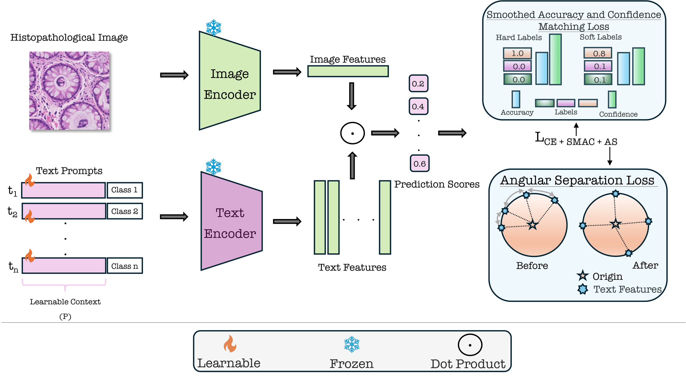
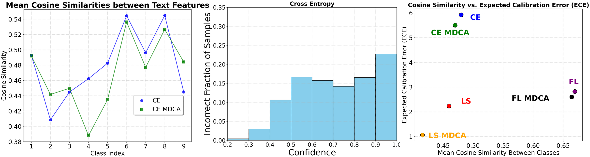
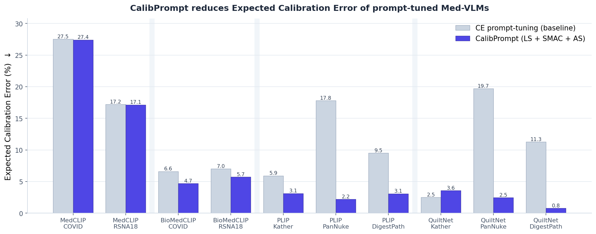

# Calibration-Aware Prompt Learning for Medical Vision-Language Models

> [**Abhishek Basu**](https://iabh1shekbasu.github.io)¹, [**Fahad Shamshad**](https://scholar.google.com/citations?user=d7QL4wkAAAAJ&hl=en)¹, [**Ashshak Sharifdeen**](https://scholar.google.com/citations?user=rd9zSX8AAAAJ&hl=en)¹, [**Karthik Nandakumar**](https://www.cse.msu.edu/~nandakum/)¹², [**Muhammad Haris Khan**](https://m-haris-khan.com)¹
>
> ¹ Mohamed Bin Zayed University of Artificial Intelligence (MBZUAI),&nbsp;UAE &nbsp;&nbsp;·&nbsp;&nbsp; ² Michigan State University (MSU),&nbsp;USA

[](https://arxiv.org/abs/2509.15226)
[](https://arxiv.org/abs/2509.15226)
[](https://arxiv.org/abs/2509.15226)
[](https://iabh1shekbasu.github.io/CalibPrompt/)
[](LICENSE)

<hr>

## 📢 Latest Updates
- **[11 July 2026]** ✅ **Full code release** — training, evaluation, configs, and the plug-and-play calibration losses. Every reported number is exactly reproducible (see [Results](#-results)).
- **[16 Oct 2025]** ✅ Plug-and-play implementations of the proposed loss functions released.
- **[19 Sep 2025]** ✅ Short paper accepted to the **SafeMM-AI Workshop @ ICCV 2025** 🎉
- **[18 Sep 2025]** 📄 Paper released on [arXiv](https://arxiv.org/abs/2509.15226) 🎉
- **[25 Jul 2025]** ✅ Paper accepted to **BMVC 2025** 🎉
- **[17 Apr 2025]** 🏆 **Best Poster Award** at the MBZUAI Research Showcase 🎉

<br>

## 🏆 Awards & Recognition
- 🎓 **Accepted at BMVC 2025**.
- 🛡️ **Accepted at the SafeMM-AI Workshop @ ICCV 2025**.
- 🏆 **Best Poster Award**, MBZUAI Research Showcase (April 2025).

<br>

## 🧠 Overview

<p align="center">
  
</p>

Medical Vision-Language Models (Med-VLMs) achieve strong zero-shot performance on clinical tasks, but they are often **miscalibrated** — their confidence scores do not reflect the true likelihood of correctness. In high-stakes clinical settings, such overconfident errors undermine trust and safe decision-making.

We introduce **CalibPrompt**, the *first* framework to calibrate Med-VLMs **during prompt tuning** (rather than as a post-hoc fix). Keeping the image and text encoders frozen, CalibPrompt learns only a small set of text-prompt tokens (~**0.1%** of parameters) under a scarce-labeled-data regime, optimizing a task loss together with two lightweight calibration objectives:

- **SMAC** — *Smoothed Accuracy and Confidence Matching*: aligns each class's mean predicted confidence with a smoothed empirical class frequency, tolerating the inherent ambiguity of medical images.
- **AS** — *Angular Separation loss*: spreads the class text prototypes apart (minimizes their pairwise cosine similarity), directly countering the overconfidence caused by prompt tuning.

CalibPrompt consistently improves calibration across **four Med-VLMs** (PLIP, QuiltNet, MedCLIP, BioMedCLIP) and **five medical datasets** (COVID, RSNA18, Kather, PanNuke, DigestPath), with minimal impact on accuracy.

<br>

|  |
|:--|
| **Why are prompt-tuned Med-VLMs miscalibrated?** Prompt tuning increases the intra-class cosine similarity of text features (*left*), inflating confidence and producing overconfident misclassifications concentrated at high confidence (*middle*); across losses, higher text-feature similarity correlates directly with higher calibration error (*right*). CalibPrompt's **Angular Separation** loss is designed to counteract exactly this. |

<br>

## ✨ Highlights
- **First calibration framework for Med-VLMs at the prompt-tuning stage** — tunes only ~0.1% of parameters; encoders stay frozen.
- **Two plug-and-play calibration losses** ([`trainers/classification/losses.py`](trainers/classification/losses.py)) — **SMAC** and **AS** drop into any CoOp-style prompt-learning pipeline alongside CE / Label Smoothing / Focal Loss.
- **Broad, reproducible evaluation** — 4 Med-VLMs × 5 datasets, plus 10+ calibration baselines (MDCA, DCA, MMCE, MbLS, LogitNorm, ZS-Norm, Penalty, …), all in one loss registry.
- **Every reported number reproduces exactly** from this code (verified against the paper's Tables 1–2).

<br>

## 📋 Table of Contents
- [Installation](#️-installation)
- [Models](#-models)
- [Datasets](#-datasets)
- [Code Structure](#-code-structure)
- [Method](#-method)
- [Run Experiments](#-run-experiments)
- [Results](#-results)
- [Citation](#-citation)
- [Contact](#-contact)
- [Acknowledgement](#-acknowledgement)

<br>

## ⚙️ Installation
See [docs/INSTALL.md](docs/INSTALL.md) for details.

```shell
conda create -n calibprompt python=3.9 -y
conda activate calibprompt

git clone https://github.com/iabh1shekbasu/CalibPrompt
cd CalibPrompt
bash setup_env.sh          # PyTorch + vendored Dassl.pytorch + dependencies
```

<br>

## 🧩 Models
CalibPrompt is evaluated on four medical foundation models. Download the pretrained weights (see [docs/MODELS.md](docs/MODELS.md) for links + the exact layout) and set `MODEL_ROOT`. BioMedCLIP downloads automatically from the HuggingFace Hub.

| Model | Modality | Datasets | Source |
|:--|:--|:--|:--|
| [MedCLIP](https://github.com/RyanWangZf/MedCLIP) | Radiology | COVID, RSNA18 | GitHub |
| [BioMedCLIP](https://huggingface.co/microsoft/BiomedCLIP-PubMedBERT_256-vit_base_patch16_224) | Radiology | COVID, RSNA18 | HuggingFace |
| [PLIP](https://github.com/PathologyFoundation/plip) | Histopathology | Kather, PanNuke, DigestPath | GitHub |
| [QuiltNet](https://quilt1m.github.io/) | Histopathology | Kather, PanNuke, DigestPath | HuggingFace |

<br>

## 🗂️ Datasets
Five public medical classification datasets, using the **same sources and preprocessing as [BAPLe](https://github.com/asif-hanif/baple)**. Full instructions in [docs/DATASETS.md](docs/DATASETS.md).

| Dataset | Type | Classes | Source |
|:--|:--|:--:|:--|
| [COVID](https://www.kaggle.com/datasets/tawsifurrahman/covid19-radiography-database) | Chest X-ray | 2 | Kaggle |
| [RSNA18](https://www.kaggle.com/c/rsna-pneumonia-detection-challenge/data) | Chest X-ray | 3 | Kaggle |
| [Kather](https://zenodo.org/records/1214456) | Histopathology | 9 | Zenodo |
| [PanNuke](https://warwick.ac.uk/fac/cross_fac/tia/data/pannuke) | Histopathology | 2 | Warwick TIA |
| [DigestPath](https://drive.google.com/drive/folders/1_19Nz7mPuLReYA60UAtcnsAotTqZk0Je) | Histopathology | 2 | DigestPath 2019 |

Place datasets under a directory pointed to by `DATASET_ROOT` (each as `<name>/images/{train,test}/<class>/` + `classnames.txt`).

<br>

## 📁 Code Structure
```
CalibPrompt/
├── train.py                          # entry point (Dassl trainer builder + loss config schema)
├── parse_test_res.py                 # aggregate metrics (ECE, MCE, ACE, KDE-ECE, ...) across runs
├── setup_env.sh                      # one-command environment bootstrap
├── requirements.txt
├── Dassl.pytorch/                    # vendored dataset + training framework
├── configs/
│   ├── datasets/                     # covid, rsna18, kather, pannuke, digestpath
│   └── trainers/                     # CoOp (PLIP/QuiltNet), CoOp_MedCLIP, CoOp_BioMedCLIP, ZeroshotCLIP
├── trainers/classification/
│   ├── coop.py                       # CLIP / PLIP / QuiltNet prompt learner
│   ├── coop_medclip.py               # MedCLIP prompt learner
│   ├── coop_biomedclip.py            # BioMedCLIP prompt learner
│   ├── zsclip.py                     # frozen zero-shot reference
│   ├── base_learner.py               # shared train/eval loop
│   └── losses.py                     # ★ loss registry: SMAC, AS + CE/LS/FL/MDCA/DCA/MMCE/MbLS/LogitNorm/...
├── datasets/                         # Dassl dataset loaders
├── models/                           # backbone code (clip, open_clip, medclip) — weights downloaded separately
├── tools/metrics.py                  # calibration metrics (ECE / MCE / ACE / KDE-ECE)
├── evaluators/vl_evaluator.py        # calibration-aware vision-language evaluator
├── scripts/classification/           # per-backbone launcher scripts (call train.py)
├── run/classification/               # per-backbone driver scripts (few-shot / zero-shot loops + parsing)
├── docs/                             # INSTALL.md, DATASETS.md, MODELS.md
└── assets/                           # figures
```

> **Plug-and-play losses.** The SMAC and AS losses live in [`trainers/classification/losses.py`](trainers/classification/losses.py) as a `LossRegistry`. Enable any combination via `TRAINER.COOP.LOSS.ENABLED_LOSSES` in a config — no other code changes needed.

<br>

## 🔬 Method
CalibPrompt learns prompt context vectors `P` on a frozen Med-VLM by minimizing a task loss plus the two calibration regularizers:

```math
\min_{P} \; \frac{1}{N}\sum_{n}\Big[\, \mathcal{L}_{\text{task}}\big(f_P(I_n), y_n\big) \;+\; \alpha\,\mathcal{L}_{\text{SMAC}} \;+\; \beta\,\mathcal{L}_{\text{AS}} \,\Big]
```

The task loss defaults to **Label Smoothing** (the paper's strongest variant) and can be swapped for Cross-Entropy or Focal Loss. All losses are selected per config via `TRAINER.COOP.LOSS.ENABLED_LOSSES`; the released configs set CalibPrompt as the default:

```yaml
TRAINER:
  COOP:
    LOSS:
      ENABLED_LOSSES: ['LS', 'SMAC', 'AS']   # CalibPrompt
      LS:   { WEIGHT: 1.0, ALPHA: <alpha> }  # LS and SMAC share the same alpha
      SMAC: { WEIGHT: 1.0, ALPHA: <alpha> }
      AS:   { WEIGHT: <as_weight> }
```

**Hyperparameters (per backbone, dataset).** The Label-Smoothing and SMAC smoothing share the same value **α**; radiology values are set in the trainer configs, histopathology values are applied automatically per dataset by the `run/` driver scripts.

| Backbone | Dataset | α (LS = SMAC) | AS weight |
|:--|:--|:--:|:--:|
| MedCLIP | COVID, RSNA18 | 0.2 | 1.0 |
| BioMedCLIP | COVID, RSNA18 | 0.1 | 3.0 |
| PLIP | Kather | 0.05 | 0.01 |
| PLIP | PanNuke | 0.2 | 0.1 |
| PLIP | DigestPath | 0.03 | 0.001 |
| QuiltNet | Kather | 0.01 | 1.0 |
| QuiltNet | PanNuke | 0.1 | 0.001 |
| QuiltNet | DigestPath | 0.05 | 0.001 |

To reproduce a baseline instead, set `ENABLED_LOSSES` to a single method, e.g. `['CE']`, `['LS']`, `['FL']`, `['LOGITNORM']`, `['MBLS']`.

<br>

## 🚀 Run Experiments
Point the environment variables at your data and weights (or edit the defaults at the top of the scripts), then launch — the only argument is the GPU id:

```shell
export DATASET_ROOT=/path/to/med-datasets    # default: ./med-datasets
export MODEL_ROOT=/path/to/models            # default: ./models

## Few-shot prompt tuning (CalibPrompt)
bash run/classification/fewshot/all_fewshot_plip.sh       0    # PLIP  → kather, pannuke, digestpath
bash run/classification/fewshot/all_fewshot_quiltnet.sh   0    # QuiltNet → kather, pannuke, digestpath
bash run/classification/fewshot/all_fewshot_medclip.sh    0    # MedCLIP → covid, rsna18
bash run/classification/fewshot/all_fewshot_biomedclip.sh 0    # BioMedCLIP → covid, rsna18

## Zero-shot evaluation
bash run/classification/zeroshot/all_zeroshot_plip.sh     0
```

Each driver loops over its datasets/seeds, calls `train.py`, and aggregates calibration metrics with `parse_test_res.py`. Results are written under `output/`.

<br>

## 📊 Results
CalibPrompt (**LS + SMAC + AS**) sharply lowers Expected Calibration Error (ECE) versus vanilla CE prompt tuning, while keeping accuracy intact. **The numbers below reproduce exactly from this code** (verified against the paper's Tables 1–2).

<p align="center">
  
</p>

**Expected Calibration Error (%, ↓)** — CE prompt-tuning → CalibPrompt:

| | PLIP · Kather | PLIP · PanNuke | PLIP · DigestPath | QuiltNet · Kather | QuiltNet · PanNuke | QuiltNet · DigestPath |
|:--|:--:|:--:|:--:|:--:|:--:|:--:|
| CE (baseline) | 5.92 | 17.82 | 9.50 | 2.49 | 19.70 | 11.27 |
| **CalibPrompt** | **3.11** | **2.19** | **3.08** | 3.58 | **2.47** | **0.77** |

| | BioMedCLIP · COVID | BioMedCLIP · RSNA18 | MedCLIP · COVID | MedCLIP · RSNA18 |
|:--|:--:|:--:|:--:|:--:|
| CE (baseline) | 6.61 | 7.02 | 27.51 | 17.21 |
| **CalibPrompt** | **4.69** | **5.74** | **27.41** | **17.14** |

See the [paper](https://arxiv.org/abs/2509.15226) for the full tables (accuracy, additional calibration metrics, focal-loss variants, and ablations). Reproduce any cell with `bash run/classification/fewshot/all_fewshot_<backbone>.sh <gpu>`.

<br>

## 📖 Citation
If you find CalibPrompt useful, please consider citing:

```bibtex
@inproceedings{Basu_2025_BMVC,
  author    = {Abhishek Basu and Fahad Shamshad and Ashshak Sharifdeen and Karthik Nandakumar and Muhammad Haris Khan},
  title     = {Calibration-Aware Prompt Learning for Medical Vision-Language Models},
  booktitle = {36th British Machine Vision Conference 2025, {BMVC} 2025, Sheffield, UK, November 24-27, 2025},
  publisher = {BMVA},
  year      = {2025},
  url       = {https://bmva-archive.org.uk/bmvc/2025/assets/papers/Paper_1062/paper.pdf}
}
```

<br>

## 📧 Contact
For questions, please open an issue or contact:
- **Abhishek Basu** — abhishek.basu@mbzuai.ac.ae
- **Fahad Shamshad** — fahad.shamshad@mbzuai.ac.ae
- **Ashshak Sharifdeen** — ashshak.sharifdeen@mbzuai.ac.ae

<br>

## 🙏 Acknowledgement
This codebase builds on [CoOp](https://github.com/KaiyangZhou/CoOp) and [Dassl.pytorch](https://github.com/KaiyangZhou/Dassl.pytorch) for prompt learning, on [CLIP_Calibration](https://github.com/ml-stat-Sustech/CLIP_Calibration) for the calibration-metric and evaluation scaffolding, and follows the medical-VLM setup of [BAPLe](https://github.com/asif-hanif/baple). We thank the authors for releasing their code.

<br>

## 📄 License
Released under the [MIT License](LICENSE).
