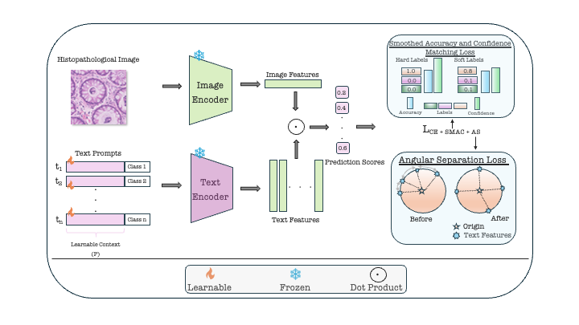

# Calibration-Aware Prompt Learning for Medical Vision-Language Models

> [**Abhishek Basu**](https://iabh1shekbasu.github.io)¹, [**Fahad Shamshad**](https://scholar.google.com/citations?user=d7QL4wkAAAAJ&hl=en)¹, [**Ashshak Sharifdeen**](https://scholar.google.com/citations?user=rd9zSX8AAAAJ&hl=en)¹, [**Karthik Nandakumar**](https://www.cse.msu.edu/~nandakum/)¹'², [**Muhammad Haris Khan**](https://m-haris-khan.com)¹

¹ Mohamed Bin Zayed University of Artificial Intelligence, UAE  
² Michigan State University, USA


[](https://arxiv.org/abs/2509.15226)
[](https://arxiv.org/abs/2509.15226)
[](https://github.com/iabh1shekbasu/CalibPrompt)
[](LICENSE)

## 📢 Latest Updates
- **[16th October 2025]** ✅ Implementations of the proposed loss functions for Plug-and-Play training are now available.
- **[19th September 2025]** ✅ Short paper accepted to SafeMM-AI Workshop @ ICCV 2025 🎉 
- **[18th September 2025]** 📄 Paper released on ArXiv 🎉 
- **[25th July 2025]** ✅ Paper accepted to BMVC 2025 🎉 
- **[17th April 2025]** 🏆 Best Poster Award at MBZUAI Research Showcase 🎉 

---

## 🏆 Awards & Recognition

✅ **Accepted** at **British Machine Vision Conference (BMVC) 2025** — *Core A-Ranked Computer Vision Conference*

✅ **Accepted** at **Safe and Trustworthy Multimodal AI Systems Workshop (SafeMM-AI)** @ ICCV 2025 — *Core A\*-Ranked Computer Vision Conference*

🏆 **Best Poster Award** at MBZUAI Research Showcase, April 2025

---

## 🧠 Overview

<p align="center">
  
</p>

Medical Vision-Language Models (Med-VLMs) demonstrate strong zero-shot performance on clinical tasks but are often miscalibrated, undermining trust in high-stakes settings.  
We propose **CalibPrompt**, the first framework that enhances Med-VLM calibration during prompt tuning by introducing two novel losses:
- **SMAC**: Smoothed Accuracy and Confidence Matching Loss
- **Angular Separation Loss**: Encourages textual feature diversity

CalibPrompt consistently improves calibration across **four Med-VLMs** (PLIP, MedCLIP, QuiltNet, BioMedCLIP) and **five medical datasets** (COVIDX, RSNA18, Kather, PanNuke, DigestPath), all while tuning only **0.1%** of model parameters.

---

## Code Release: 

Implementations of the proposed loss functions for Plug-and-Play training are now available.

🔜 Full code release coming soon.

---

## 📖 Citation

If you find this work useful for your research, please cite:

```bibtex
@inproceedings{basu2025calibprompt,
  title={Calibration-Aware Prompt Learning for Medical Vision-Language Models},
  author={Basu, Abhishek and Shamshad, Fahad and Sharifdeen, Ashshak and Nandakumar, Karthik and Khan, Muhammad Haris},
  booktitle={British Machine Vision Conference (BMVC)},
  year={2025}
}
```
and
```bibtex
@thesis{basu2025calibration,
  title        = {Calibration-Aware Prompt Learning for Medical Vision-Language Models},
  author       = {Basu, Abhishek},
  type         = {Master’s thesis},
  institution  = {Mohamed Bin Zayed University of Artificial Intelligence (MBZUAI)},
  year         = {2025},
  location     = {Abu Dhabi, United Arab Emirates},
  department   = {Computer Vision}
}
```

## 📧 Contact

For questions about this work, please contact:

- **Abhishek Basu**: abhishek.basu@mbzuai.ac.ae
- **Fahad Shamshad**: fahad.shamshad@mbzuai.ac.ae
- **Ashshak Sharifdeen**: ashshak.sharifdeen@mbzuai.ac.ae

## 📄 License

This project will be released under the MIT License. See [LICENSE](LICENSE) file for details.

---

**Note**: This repository is associated with the paper accepted at BMVC 2025. Stay tuned for the code release!


